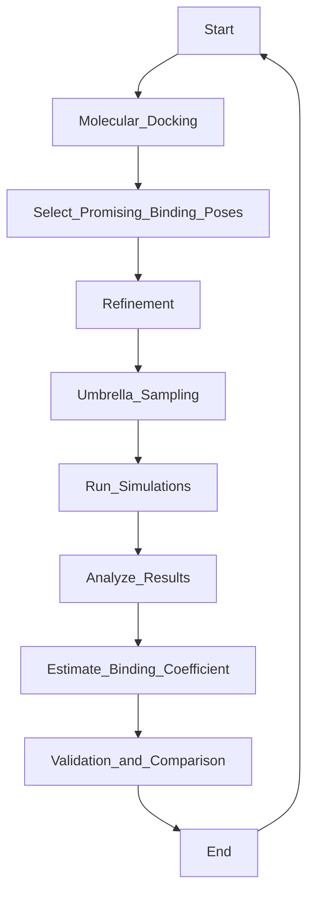

```mermaid
graph TD;
    Start --> Molecular_Docking;
    Molecular_Docking --> Select_Promising_Binding_Poses;
    Select_Promising_Binding_Poses --> Refinement;
    Refinement --> Umbrella_Sampling;
    Umbrella_Sampling --> Run_Simulations;
    Run_Simulations --> Analyze_Results;
    Analyze_Results --> Estimate_Binding_Coefficient;
    Estimate_Binding_Coefficient --> Validation_and_Comparison;
    Validation_and_Comparison --> End;
    End --> Start;
```