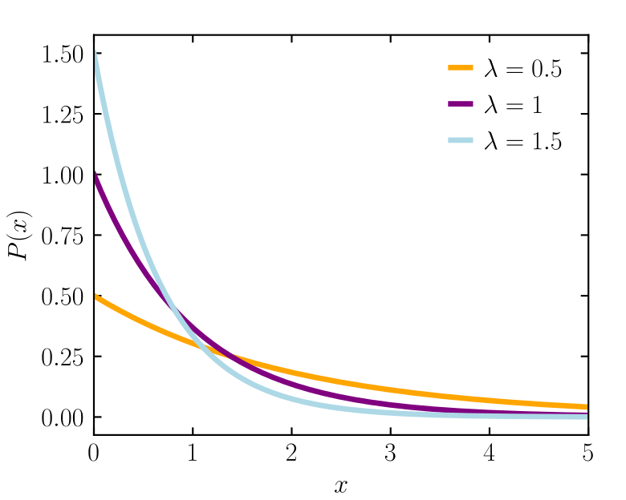
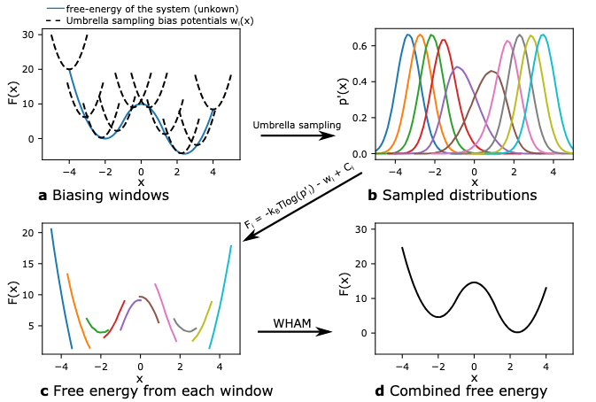

# Add Permissions for Wham Subprocess

#### MacOS
This command adds executable permissions to the owner, group, and complementary:
~~~
cd path_to_scoresolver
cd wham
cd wham
chmod +x wham
~~~

To verify the command worked, run:
~~~
ls -l wham
~~~

If it says 
~~~
chmod: wham: No such file or directory
~~~

Execute the command to compile wham.c
~~~
make
~~~

Example Output:

~~~
-rwxr-xr-x  1 user  group  12345678 date wham
~~~

# Program
~~~mermaid
---
title: Bind Coefficient Calculation
---
graph LR;
    pdb[("test.pdb")]
    win["windows"]
    mt["metafile.txt & cv data"]
    pmf["pmf.txt"]
    traj["smd_traj.dcd"]
    wl["wham_logs.txt"]
    pdb -- "SMD Pulling Loop" --> traj & win
    win -- "Umbrella Sampling" --> mt
    mt -- "WHAM ANALYSIS" --> pmf & wl
~~~

---

# Troubleshooting

If the histograms have poor overlap you will need to use more windows and/or reduce the spring constant.

The windows do not need to be linearly spaced and they can have different spring constants.

---

## Theory

In all, the main theory is that we are pulling a complex or whatever at two pivotal important atoms. Then, it constructs the curve that describes the total amount of free energy used to pull the protein. If you don't know, free energy is usable energy that can be accessed by the system. Unusable energy at a moment in time would include the energy that is distributed with less of a probability to be gathered to be used as work. There is no concrete of what "usable work" is, but it is described as the most average and suitable approximation of how much energy can be used. In other words, its a statistical quantity.

### Definitions

- $ F $: Free energy
- $ k_B $: Boltzmann constant
- $ T $: Temperature
- $Z $: Canonical partition function
- $ \xi $: Collective Variable (CV) $\to$ represents the progress of a reaction into a single value of a **state**
- $ \mathbf{r} $: Atomic coordinates
- $ P(\xi) $: Probability distribution of the system as a function of CV
- $ \beta $: Inverse temperature ($\beta = 1 / k_B T $)
- $ U(\mathbf{r}) $: Potential energy of the system
- $ U_i^{\text{bias}} $: Biasing potential for window $ i $
- $ k $: Force constant for the biasing potential
- $ \xi_i $: Target value of the CV in window $ i $
- $ P_i^{\text{bias}}(\xi) $: Biased probability distribution for window $ i $
- $ n_i(\xi) $: Number of samples in bin $ \xi $ for window $ i $
- $ F_i^{\text{bias}}(\xi) $: Biased free energy in window \( i \)
- $ F(\xi) $: Unbiased free energy (Potential of Mean Force, PMF)
- $ {\displaystyle \delta _{a}(x)}$: Dirac delta function

### Equations

1. Reaction Coordinate
   $$
   \xi(\textbf{r}) = \textrm{the progress of a reaction as function of atomic configuration/coordinates}
   $$
   Note: different atomic configurations $\textbf{r}$ can have the same reaction coordinate due to $\xi$'s limited scope, especially in reversible reactions/processes. However, this is a necessary sacrifice because we need to reduce complexity and dimension of the problem. Essentially, $\xi$ is a simplification of $\textbf{r}$.
2. Free energy in the canonical ensemble:
   $$
   F = -k_B T \ln Z
   $$

   In context, $F$ can be expressed in terms of a specific state $\xi$, so $F(\xi) = -k_B T \ln P(\xi) + C$

3. Dirac Delta Function: ($\delta(x) = \delta_1(x)$):
   $$
   {\displaystyle \delta _{a}(x)={\frac {1}{\left|a\right|{\sqrt {\pi }}}}e^{-(x/a)^{2}}}
   $$

   In the case of this theory, it projects the space of $\textbf{r}$ to the space of $\xi$. It picks out the relevant values of $\xi (\textbf{r})$ close to the value $\xi$ in question and concentrates/amplifies those specific values of $\textbf{r}$.

   $$
   P(\xi)=\int P(\textbf{r})\delta(\xi−\xi(\textbf{r}))d\textbf{r}
   $$

4. Partition Function (discrete):

   $$
   Z = \sum \textrm{energies of i}^\textrm{th}  \textrm{ state weighed by boltzmann distribution factor} = \sum_{i}{e^{-\beta E_i}}
   $$

   Encapsulates the total distribution of energy, which can later be used to normalize probability distributions over boltzmann factors.

5. Probability Distribution in $\textbf{r}$

   $$
   P(\textbf{r}) = \frac{\exp(-\beta E(r))}{Z} : \beta = \frac{1}{k_B T}
   $$

   Here higher values of $\beta$, or coldness, makes states with lower temperatures more probable than otherwise. While lower values of $\beta$, leading to higher temperatures, makes states with higher temperatures more probable than otherwise. Regardles of positive $\beta >0$, lower temperature states are more probable than higher temperature states. Note in this graph, $\lambda \equiv \beta$.

   

6. Probability Distribution (continous):

   $$
   P(\xi)  = \int P(\textbf{r})\delta(\xi−\xi(\textbf{r}))d\textbf{r} = \frac{1}{Z} \int e^{-\beta E(\textbf{r})}\delta(\xi−\xi(\textbf{r}))d\textbf{r} 
   $$

   Which is the integration over all possible degrees of freedom of a reaction coordinate $\xi$

   In all, its basically multiplying all the possible factors that affect the probability of having state $\xi$ and integrating them because again, probability is a statistical quantity that is approximated.

### Adding Biasing

Theoretically, when sampling without restraints, the most probable configurations will be sampled, but most of these are at the lowest of the potential energy landscape. We need to sample the areas with higher levels of energy, which would be otherwise hard to reach. Thus, we add biasing potential of window $i$:

7. Biasing Potential

   $$
   w_i(\xi) = \frac12 k(\xi - \xi_i)^2
   $$

It acts a spring force that restrains the system simulation to certain configuration $\xi$. There are multiple windows $i = 1,2,3 \ldots n$ that each sample sufficient amounts of the free energy landscape. This is the main premise of umbrella sampling that separates from other MD simulations. Note $x \equiv \xi$.

So, each quantity discussed previously must have biased version indicated by an apostrophe superscript $'$.After computing/simulating the system with biasing potentials, we subtract the biased results by the biasing potential and retrive the true energy curve. 

8. Energy at window $i$ to unbiased version:
$$
E'_i(\textbf{r}) = E_i(\textbf{r}) + w_i((\xi(\textbf{r})))  \quad [8]
$$

9. Probability distribution at window $i$ to unbiased version:
$$
P_i'(\xi) \propto \int e^{-\beta (E_i'(\textbf{r}))} \delta (\xi - \xi(\textbf{r})) dr \propto P_i(\xi) e^{-\beta w_i(\xi)}, \quad [9]
$$

10. Free Energy at window $i$ to unbiased version:

$$
F'(\xi) = -k_B T \ln P_i(\xi) + w_i(\xi) + C_i = F_i(\xi) + w_i(\xi) + C_i. \quad [10]
$$

Combining equations $[8],[9],[10]$, 

$$
F_i(\xi) = F_i'(\xi)-w_i(\xi) + C_i = -k_B T \text{log}(P_i'(\xi)) - w_i + C_i.
$$

---

# Selecting Parameters

The most important parameters are:

1. $L_i$ and $L_f$: the starting and ending lengths of the complex you are trying to stretch

2. $\textrm{index1}$ and $\textrm{index2}$: the indexes of the two atoms we want to pivot as endpoints and stretch accordingly.

Virtually, $L_i$ can be easily determined by looking at the original PDB file through a MD visualizer, and $L_f$ can be any value $L_f \gg L_i$ (by maybe a factor less than $10^{2}$ ish) if you are stretching.

However, the pivot indexes can be a little tricky to determine. But, the best way to start off is by identifying your objective and looking at the starting PDB to get a glipmse at what you're working with.

**Generally Pick the strongest parts of the Complex**
   1. For proteins: C-alpha atoms are picked because they're usually the backbone atoms that represent the structure very well, so stretching that wont break the system entirely (they are strong enough to stretch).
   2. For nucleic acids: Phosphate atoms or specific base atoms (because again, they're the strongest backbones.)
   3. For small molecules or ligands: Select atoms that are involved in key interactions or are structurally significant.

If you are trying to get the binding affinity of a docked complex (which is what I am trying to do in this case,) I would select the center of mass of the ligand, and the key atom in a resiude in the binding pocket of the receptor.

As stored in the 
~~~
./gh_scoresolver/tests/pdb/ahl_dock_luxr_1.pdb
~~~

PDB file, we have a ligand protein \(\textrm{ahl}\) docked into a receptor protein \(\textrm{luxr}\).

---

# Credits

https://openmm.github.io/openmm-cookbook/latest/notebooks/tutorials/umbrella_sampling.html, https://www.sciencedirect.com/topics/biochemistry-genetics-and-molecular-biology/umba, https://en.wikipedia.org/wiki/Umbrella_sampling